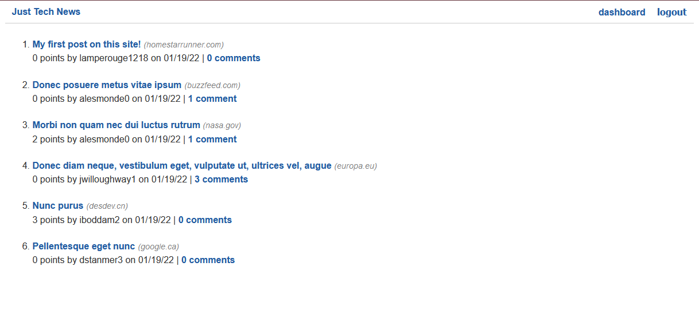

# Python Newsfeed

## Description

This is a practice application used to learn the processes of backend development using Python. It is a Tech News app that allows users to login and make posts with links to articles or other resources. It uses Python, Flask, and SQLAlchemy for the database storage of Users, Posts, Comments, and Votes, and uses bcrypt to handle hashing user passwords before they are entered into the database. 

Here is a screenshot of the deployed app:

Here is a link to the Heroku deployment: [Heroku Deployment](https://python-tech-app.herokuapp.com/)

## Table of Contents

-- [Usage](#usage)

-- [License](#license)

-- [Questions](#questions)

## Usage

Navigate to the Heroku link provided above to get to the deployed app.

Once on the Heroku app, users will can create an account, or login to a previously existing account. Posts and comments can be seen but neither comments nor post can be created, edited, or deleted until the user has logged in/created an account. Once logged in, users can create, edit, and delete their own posts, upvote other posts that they view on the homepage, and can see all of their posts arranged on their dashboard.

## License

This project is protected under the [MIT](https://choosealicense.com/licenses/mit/) license. (2022) (Phil Bohn)

## Questions

If there any questions regarding this project, I can be contacted in the following places:

GitHub: [@lamperouge1218](https://github.com/lamperouge1218)

Email: philbohn1791@gmail.com
